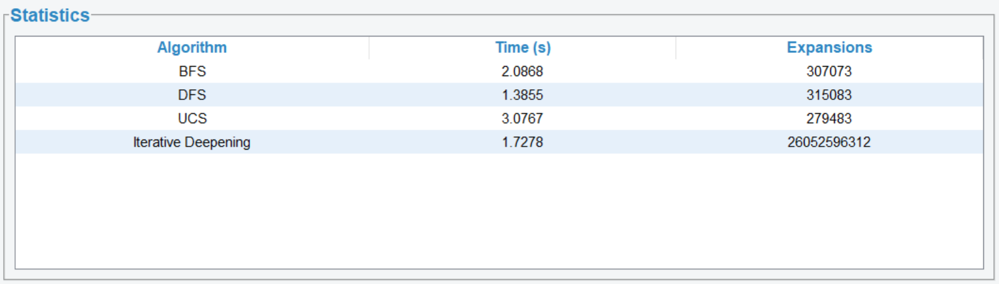
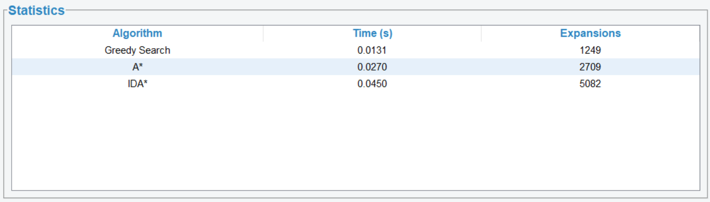
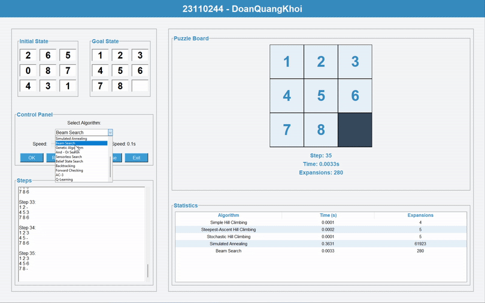
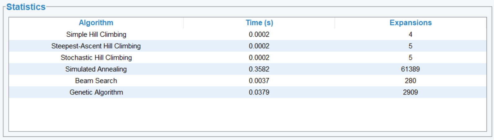
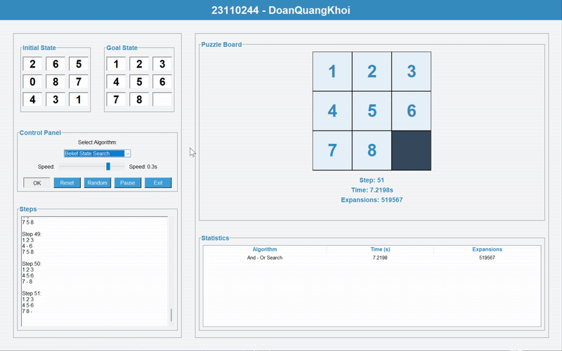
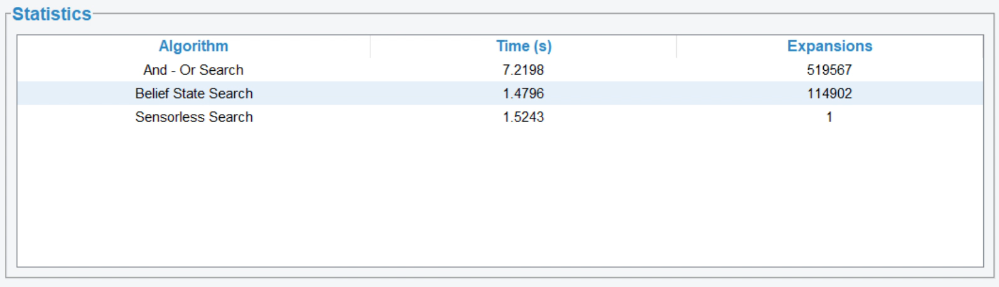
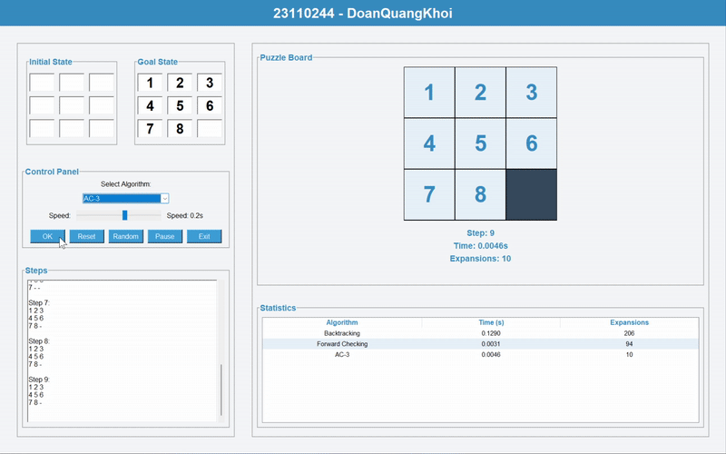
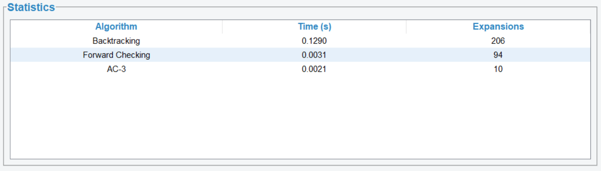
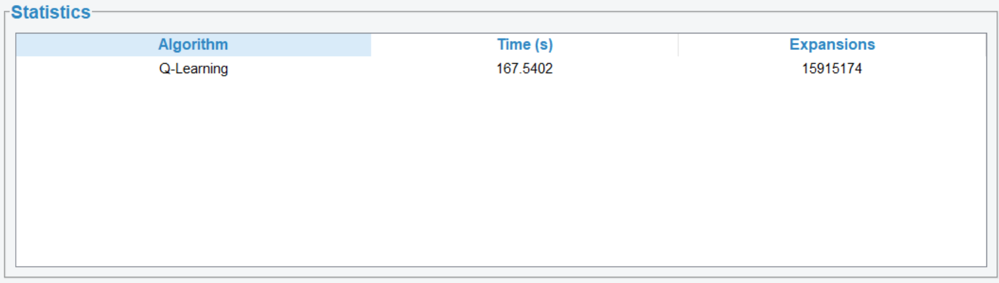

# AI_MidTerm_SelfProject_23110244
## 8 Puzzles game

---

## 1. Mục tiêu
- Xây dựng và triển khai các thuật toán tìm kiếm và học máy để giải bài toán 8-puzzle
- Tìm hiểu và áp dụng các thuật toán trong AI 

**Mục tiêu trò chơi 8 Puzzle:**
- Đưa trạng thái ban đầu (Initial State) của bảng gồm 8 ô số (từ 1 đến 8) và một ô trống (có giá trị là 0)
- Về trạng thái đích (Goal State) bằng cách di chuyển các ô liền kề với ô trống vào vị trí của ô trống
- Thuật toán sẽ thực hiện các bước di chuyển liên tiếp sao cho đạt đúng vị trí như trạng thái đích

**Trong bài toán này:**
- Trạng thái của bảng được biểu diễn dưới dạng ma trận 3x3 
- Một trạng thái hợp lệ phải có đủ các số từ 0 đến 8 và chỉ có một số 0 (ô trống)
- Mỗi bước di chuyển chỉ có thể hoán đổi ô trống với một ô số kế bên theo hướng lên, xuống, trái hoặc phải

**Mục tiêu chính là:**
- Áp dụng các thuật toán AI (không có thông tin như BFS, DFS, UCS... và có thông tin như A*, Greedy...) để tự động tìm ra chuỗi các bước di chuyển từ trạng thái đầu đến trạng thái đích
- Đánh giá hiệu quả các thuật toán dựa trên thời gian thực thi, số lượng node được mở rộng và số bước trong lời giải

**Ứng dụng của game:**
- Theo dõi quá trình giải theo từng bước
- So sánh hiệu quả các thuật toán thông qua thống kê chi tiết
- Giúp sinh viên hiểu rõ cách các thuật toán AI hoạt động, từ đó áp dụng vào các bài toán phức tạp hơn trong lĩnh vực AI.

---

## 2. Nội dung
### 2.1. Các thuật toán UNINFORMED SEARCH
#### Thành phần chính:
- **Trạng thái (State):** Ma trận 3x3 đại diện cho vị trí các ô số từ 1 đến 8 và ô trống (0)
- **Không gian trạng thái (State Space):** Tập hợp tất cả các trạng thái hợp lệ mà trò chơi có thể đạt tới
- **Trạng thái đầu (Initial State):** Ma trận 3x3 với các số được sắp xếp ngẫu nhiên, không trùng lặp
- **Trạng thái đích (Goal State):** Ma trận 3x3 với các số theo thứ tự chuẩn, ví dụ: [[1, 2, 3], [4, 5, 6], [7, 8, 0]]
- **Hành động:** Di chuyển ô trống (0) lên, xuống, trái, phải nếu hợp lệ
- **Chi phí:** Đối với thuật toán Uniform Cost Search (UCS), mỗi bước di chuyển sẽ được gán một chi phí. UCS sẽ tìm đường đi có tổng chi phí nhỏ nhất từ trạng thái đầu đến trạng thái đích

#### Solution:
- Một dãy các trạng thái (hay các hành động) từ trạng thái ban đầu đến trạng thái mục tiêu

#### Các thuật toán:
1. **Thuật toán Breadth-First Search (BFS)**  

2. **Thuật toán Depth-First Search (DFS)**  

3. **Thuật toán Uniform Cost Search (UCS)**  

4. **Thuật toán Iterative Deepening Depth-First Search (IDDFS)** 

#### So sánh hiệu suất

- **BFS**: Tìm kiếm theo chiều rộng, đảm bảo tìm được lời giải tối ưu nhưng tốn nhiều bộ nhớ
- **DFS**: Tìm kiếm theo chiều sâu, nhanh nhưng không đảm bảo tối ưu
- **UCS**: Tìm kiếm chi phí đồng nhất, đảm bảo tối ưu nhưng chậm hơn BFS
- **IDDFS**: Kết hợp ưu điểm của BFS và DFS, hiệu quả hơn trong một số trường hợp

#### Nhận xét:
- Các thuật toán trong nhóm này phù hợp với bài toán nhỏ như 8-puzzle
- **BFS** và **UCS** đảm bảo tìm được lời giải tối ưu nhưng tốn tài nguyên
- **DFS** và **IDDFS** phù hợp hơn khi bộ nhớ hạn chế

---

### 2.2. Các thuật toán INFORMED SEARCH
#### Thành phần chính
- **Trạng thái (State):** Ma trận 3x3 đại diện cho vị trí các ô số từ 1 đến 8 và ô trống (0)
- **Không gian trạng thái (State Space):** Tập hợp tất cả các trạng thái hợp lệ mà trò chơi có thể đạt tới
- **Trạng thái đầu (Initial State):** Ma trận 3x3 với các số được sắp xếp ngẫu nhiên, không trùng lặp
- **Trạng thái đích (Goal State):** Ma trận 3x3 với các số theo thứ tự chuẩn
- **Hành động:** Di chuyển ô trống (0) lên, xuống, trái, phải nếu hợp lệ
- **Chi phí:** Mỗi bước di chuyển có chi phí 1 (áp dụng cho A*, IDA*).

#### Solution
- Một dãy các trạng thái hoặc hành động từ trạng thái đầu đến trạng thái đích, đảm bảo tối ưu nếu dùng A\*.

#### Các thuật toán:
1. **Thuật toán Greedy Search**
- Ưu điểm: Tốc độ nhanh, dễ cài đặt
- Nhược điểm: Không đảm bảo tìm được lời giải tối ưu, dễ mắc kẹt ở vùng tối ưu cục bộ

2. **Thuật toán A\***         
- Cách hoạt động: Kết hợp chi phí đã đi (g) và heuristic (h) để chọn trạng thái có tổng f = g + h nhỏ nhất
- Ưu điểm: Đảm bảo tìm được lời giải tối ưu nếu heuristic chấp nhận được
- Nhược điểm: Tốn bộ nhớ và thời gian khi không gian trạng thái lớn

3. **Thuật toán Iterative Deepening A\***
- Ưu điểm: Tiết kiệm bộ nhớ hơn A*, vẫn đảm bảo tối ưu
- Nhược điểm: Có thể lặp lại nhiều trạng thái, tốc độ chậm hơn A* trong một số trường hợp

#### So sánh hiệu suất

- **Greedy Search**:Nhanh nhưng không đưuọc tối ưu
- **A\***: Tối ưu và hiệu quả đối với heuristic tốt
- **Iterative Deepening A\***:Tối ưu và tiết kiệm bộ nhớ nhưng có thể chậm hơn so với 2 thuật toán trên

#### Nhận xét:
- Các thuật toán heuristic giúp tăng tốc độ tìm kiếm và giảm số node mở rộng
- A* là lựa chọn tốt nhất khi cần lời giải tối ưu
- Greedy phù hợp khi cần giải nhanh, không yêu cầu tối ưu
- IDA* phù hợp khi bộ nhớ hạn chế

---
### 2.3. Các thuật toán LOCAL SEARCH
#### Thành phần chính:
- **Trạng thái (State):** Ma trận 3x3 đại diện cho vị trí các ô số từ 1 đến 8 và ô trống (0)
- **Không gian trạng thái (State Space):** Tập hợp tất cả các trạng thái hợp lệ mà trò chơi có thể đạt tới
- **Trạng thái đầu (Initial State):** Ma trận 3x3 với các số được sắp xếp ngẫu nhiên, không trùng lặp
- **Trạng thái đích (Goal State):** Ma trận 3x3 với các số theo thứ tự chuẩn, ví dụ: [[1, 2, 3], [4, 5, 6], [7, 8, 0]]
- **Hành động:** Di chuyển ô trống (0) lên, xuống, trái, phải nếu hợp lệ

#### Solution
- Một dãy các trạng thái từ trạng thái đầu đến trạng thái đích, có thể không tối ưu hoặc không đảm bảo tìm ra lời giải.

#### Các thuật toán:
1. **Thuật toán Simple Hill Climbing**
- **Ưu điểm:**
- **Nhược điểm:**

2. **Thuật toán Steepest - Ascent Hill Climbing**
- **Ưu điểm:**
- **Nhược điểm:**

3. **Thuật toán Stochastic Hill Climbing**
- **Ưu điểm:**
- **Nhược điểm:**

4. **Thuật toán Simulated Annealing**
- **Ưu điểm:**
- **Nhược điểm:**

5. **Thuật toán Beam Search**    
- **Ưu điểm:**
- **Nhược điểm:**
                                

6. **Thuật toán Genetic Search**                           
- **Ưu điểm:**
- **Nhược điểm:**
                

#### So sánh hiệu suất

- **Simple Hill Climbing**:
- **Steepest - Ascent Hill Climbing**:
- **Stochastic Hill Climbing**:
- **Simulated Annealing**:
- **Beam Search**:
- **Genetic Search**:

#### Nhận xét:
- 
-

---
### 2.4. Các thuật toán SEARCHING IN COMPLEX ENVIRONMENT
#### Thành phần chính:
- **Trạng thái (State):** 
- **Không gian trạng thái (State Space):** 
- **Trạng thái đầu (Initial State):** 
- **Trạng thái đích (Goal State):** 
- **Hành động (Actions):** 
- **Chi phí (Cost) (nếu có):**

#### Solution
- **Solution:**

#### Các thuật toán:
1. **Thuật toán And - Or Search**
- **Ưu điểm:**
- **Nhược điểm:**

2. **Thuật toán Sensorless**
- **Ưu điểm:**
- **Nhược điểm:**

3. **Thuật toán Belief - BFS (Partial Environment)**
- **Ưu điểm:**
- **Nhược điểm:**

#### So sánh hiệu suất

- **And - Or Search**:
- **Sensorless Search**:
- **Belief - State**:

#### Nhận xét:

---
### 2.5. Các thuật toán CONSTRAINT SATISFACTION PROBLEM
#### Thành phần chính:
- **Trạng thái (State):** 
- **Không gian trạng thái (State Space):** 
- **Trạng thái đầu (Initial State):** 
- **Trạng thái đích (Goal State):** 
- **Hành động (Actions):**

#### Solution
- **Solution:**

#### Các thuật toán:
1. **Thuật toán Backtracking**
- **Ưu điểm:**
- **Nhược điểm:**

2. **Thuật toán AC - 3**
- **Ưu điểm:**
- **Nhược điểm:**

3. **Thuật toán Forwarding Checking**
- **Ưu điểm:**
- **Nhược điểm:**

#### So sánh hiệu suất

- **Backtracking**:
- **AC - 3**:
- **Forwarding Checking**:

#### Nhận xét:

---
### 2.6. Các thuật toán REINFORCEMENT LEARNING
#### Thành phần chính:
- **Trạng thái (State):** 
- **Không gian trạng thái (State Space):** 
- **Trạng thái đầu (Initial State):** 
- **Trạng thái đích (Goal State):** 
- **Hành động (Actions):** 

#### Solution
- **Solution:**

#### Các thuật toán:
1. **Thuật toán Q - Learning**    
- **Ưu điểm:**
- **Nhược điểm:**

#### So sánh hiệu suất

- **Q - Learning**:

#### Nhận xét:
- 

## 3. Kết luận

### 3.1. Giao diện
- Giao diện trực quan, dễ sử dụng, cho phép người dùng nhập trạng thái đầu và trạng thái đích.
- Hiển thị trực tiếp quá trình giải và các bước di chuyển của thuật toán trên bảng 8-puzzle.
- Thống kê chi tiết về thời gian thực thi, số node mở rộng, số bước giải cho từng thuật toán.

### 3.2. Thuật toán
- Đã triển khai và so sánh nhiều nhóm thuật toán: Uninformed, Informed, Local Search, Constraint Satisfaction, Reinforcement Learning.
- Các thuật toán heuristic (A*, IDA*) và học tăng cường (Q-Learning) cho kết quả tốt về hiệu quả và tốc độ.
- Các thuật toán như BFS, UCS đảm bảo tìm lời giải tối ưu nhưng tốn tài nguyên hơn.
- Local Search và các thuật toán trong môi trường phức tạp giúp mở rộng khả năng áp dụng cho các bài toán AI thực tế.

### 3.3. Ứng dụng thực tiễn
- Giúp sinh viên hiểu rõ bản chất và cách hoạt động của các thuật toán AI thông qua minh họa trực quan.
- Có thể mở rộng áp dụng cho các bài toán tổ hợp, tối ưu hóa, hoặc các trò chơi trí tuệ khác.
- Là nền tảng để nghiên cứu sâu hơn về AI, học máy, và các kỹ thuật giải quyết bài toán phức tạp trong thực tế.
