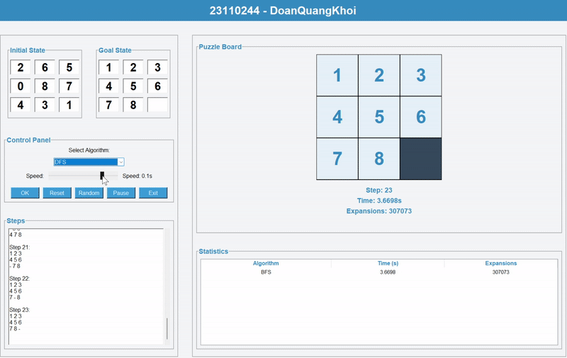
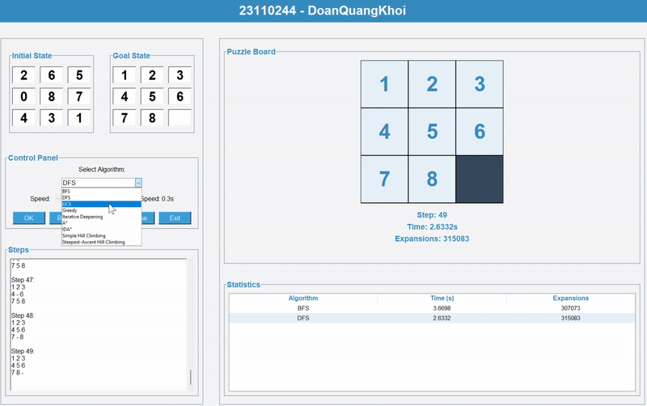
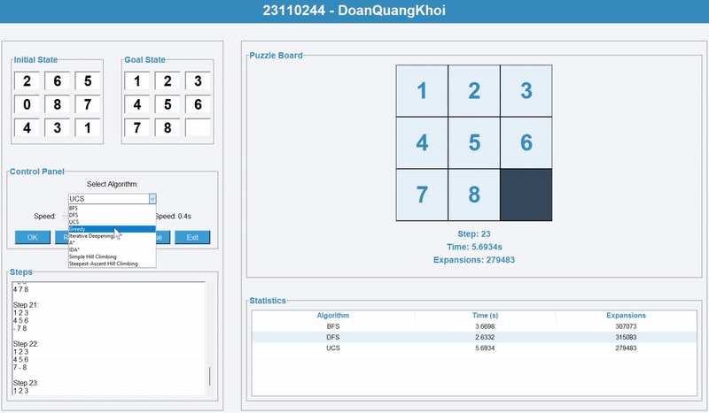
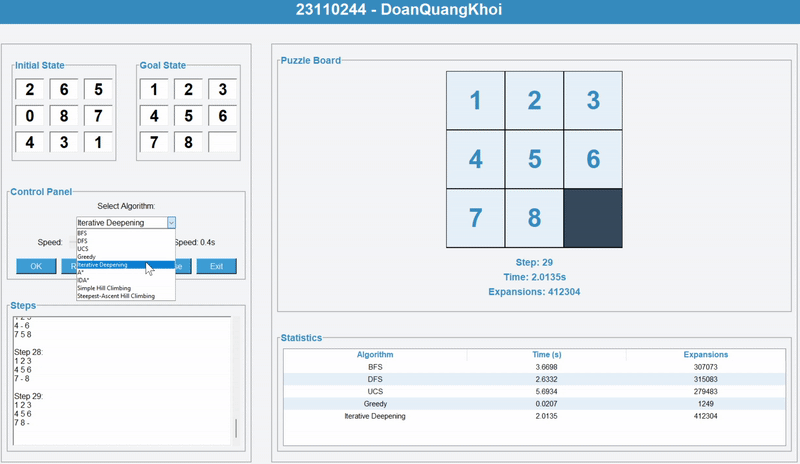
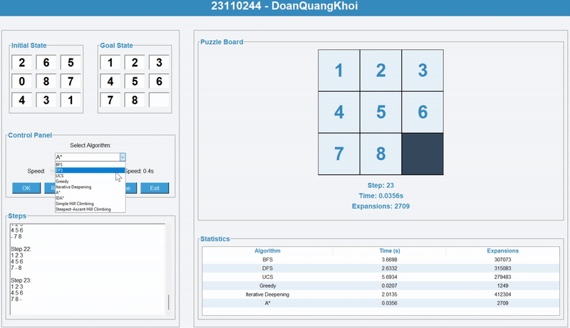
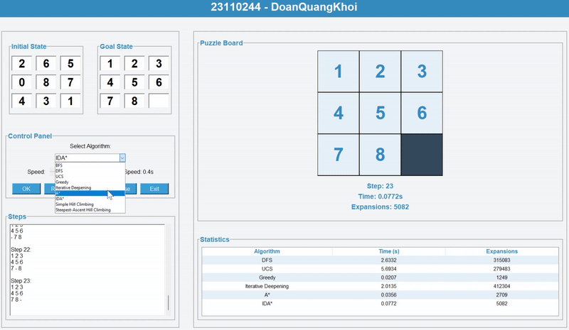
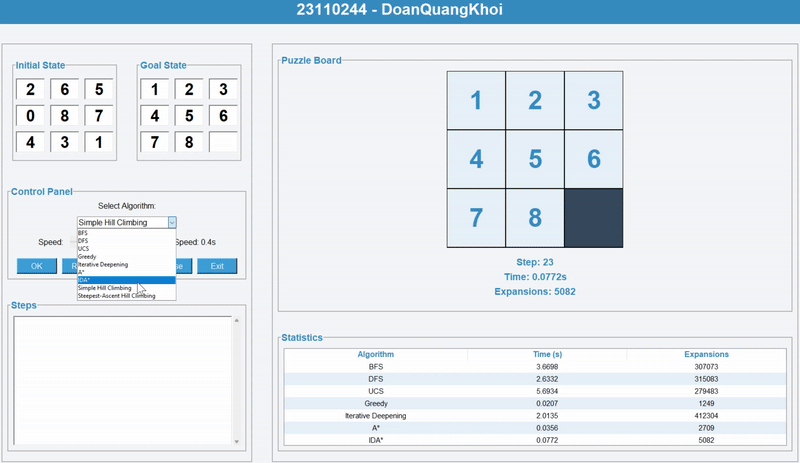
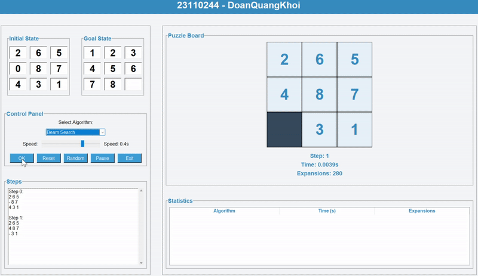

# AI_MidTerm_SelfProject_23110244
## 8 Puzzles game

---

## 1. Mục tiêu
- Xây dựng và triển khai các thuật toán tìm kiếm và học máy để giải bài toán 8-puzzle
- Tìm hiểu và áp dụng các thuật toán trong AI
**Mục tiêu chính của trò chơi 8 Puzzle:**
- Đưa trạng thái ban đầu (Initial State) của bảng gồm 8 ô số (từ 1 đến 8) và một ô trống (có giá trị là 0)
- Về trạng thái đích (Goal State) bằng cách di chuyển các ô liền kề với ô trống vào vị trí của ô trống
- Người chơi hoặc thuật toán sẽ thực hiện các bước di chuyển liên tiếp sao cho sau cùng bảng đạt đúng vị trí như trạng thái mục tiêu

**Trong bài toán này:**
- Trạng thái của bảng được biểu diễn dưới dạng ma trận 3x3 
- Một trạng thái hợp lệ phải có đủ các số từ 0 đến 8 và chỉ có một số 0 (ô trống)
- Mỗi bước di chuyển chỉ có thể hoán đổi ô trống với một ô số kế bên theo hướng lên, xuống, trái hoặc phải

**Mục tiêu chính là:**
- Áp dụng các thuật toán AI (không có thông tin như BFS, DFS, UCS... và có thông tin như A*, Greedy...) để tự động tìm ra chuỗi các bước di chuyển từ trạng thái đầu đến trạng thái đích
- Đánh giá hiệu quả các thuật toán dựa trên thời gian thực thi, số lượng node được mở rộng và số bước trong lời giải

**Ứng dụng của game:**
- Theo dõi quá trình giải theo từng bước
- So sánh hiệu quả các thuật toán thông qua thống kê chi tiết
- Giúp sinh viên hiểu rõ cách các thuật toán AI hoạt động, từ đó áp dụng vào các bài toán phức tạp hơn trong lĩnh vực AI.

---

## 2. Nội dung

### 2.1. Các thuật toán UNINFORMED SEARCH
#### Thành phần chính:
- **Trạng thái (State):** Ma trận 3x3 đại diện cho vị trí các ô số từ 1 đến 8 và ô trống (0)
- **Không gian trạng thái (State Space):** Tập hợp tất cả các trạng thái hợp lệ mà trò chơi có thể đạt tới
- **Trạng thái đầu (Initial State):** Ma trận 3x3 với các số được sắp xếp ngẫu nhiên, không trùng lặp
- **Trạng thái đích (Goal State):** Ma trận 3x3 với các số theo thứ tự chuẩn, ví dụ: [[1, 2, 3], [4, 5, 6], [7, 8, 0]]
- **Hành động (Actions):** Di chuyển ô trống (0) lên, xuống, trái, phải nếu hợp lệ
- **Chi phí (Cost):** Đối với thuật toán Uniform Cost Search (UCS), mỗi bước di chuyển sẽ được gán một chi phí. UCS sẽ tìm đường đi có tổng chi phí nhỏ nhất từ trạng thái đầu đến trạng thái đích

#### Solution:
- **Solution** là một dãy các trạng thái (hoặc dãy các hành động) dẫn từ trạng thái ban đầu đến trạng thái mục tiêu.
- Thông thường, solution được biểu diễn dưới dạng danh sách các trạng thái hoặc danh sách các hành động (up, down, left, right) để đạt được trạng thái mục tiêu.

#### Các thuật toán:
1. **Thuật toán Breadth-First Search (BFS)**  

2. **Thuật toán Depth-First Search (DFS)**  

3. **Thuật toán Uniform Cost Search (UCS)**  

4. **Thuật toán Iterative Deepening Depth-First Search (IDDFS)** 

#### So sánh hiệu suất

- **BFS**: Tìm kiếm theo chiều rộng, đảm bảo tìm được lời giải tối ưu nhưng tốn nhiều bộ nhớ.
- **DFS**: Tìm kiếm theo chiều sâu, nhanh nhưng không đảm bảo tối ưu.
- **UCS**: Tìm kiếm chi phí đồng nhất, đảm bảo tối ưu nhưng chậm hơn BFS.
- **IDDFS**: Kết hợp ưu điểm của BFS và DFS, hiệu quả hơn trong một số trường hợp.

#### Nhận xét:
- Các thuật toán trong nhóm này phù hợp với bài toán nhỏ như 8-puzzle.
- **BFS** và **UCS** đảm bảo tìm được lời giải tối ưu nhưng tốn tài nguyên.
- **DFS** và **IDDFS** phù hợp hơn khi bộ nhớ hạn chế.

---

## INFORMED SEARCH

**Thuật toán Greedy Search**

**Thuật toán A***

**Thuật toán Iterative Deepening A***

## LOCAL SEARCH

**Thuật toán Simple Hill Climbing**

**Thuật toán Steepest - Ascent Hill Climbing**

**Thuật toán Stochastic Hill Climbing**

**Thuật toán Simulated Annealing**

**Thuật toán Beam Search**

**Thuật toán Gernetic Search**

## SEARCHING IN COMPLEX ENVIRONMENT

**Thuật toán And - Or Search**

**Thuật toán Sensorless**

**Thuật toán Belief - BFS (Partial Environment)**

## CONSTRAINT SATISFACTION PROBLEM

**Thuật toán Backtracking**

**Thuật toán AC - 3**

**Thuật toán Forwarding Checking**

## REINFORCEMENT LEARNING
**Thuật toán Q - Learning**

