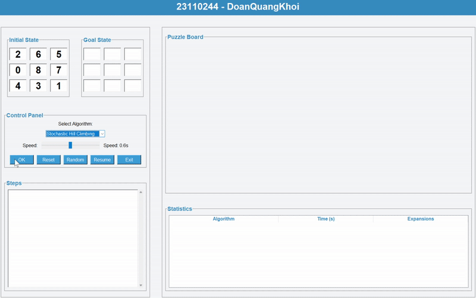

# AI_MidTerm_SelfProject_23110244_DoanQuangKhoi
## 8 Puzzles game

---

## 1. Mục tiêu
- Xây dựng và triển khai các thuật toán tìm kiếm và học máy để giải bài toán 8-puzzle
- Tìm hiểu và áp dụng các thuật toán trong AI 

**Mục tiêu trò chơi 8 Puzzle:**
- Đưa trạng thái ban đầu (Initial State) của bảng gồm 8 ô số (từ 1 đến 8) và một ô trống (có giá trị là 0)
- Về trạng thái đích (Goal State) bằng cách di chuyển các ô liền kề với ô trống vào vị trí của ô trống
- Thuật toán sẽ thực hiện các bước di chuyển liên tiếp sao cho đạt đúng vị trí như trạng thái đích

**Trong bài toán này:**
- Trạng thái của bảng được biểu diễn dưới dạng ma trận 3x3 
- Một trạng thái hợp lệ phải có đủ các số từ 0 đến 8 và chỉ có một số 0 (ô trống)
- Mỗi bước di chuyển chỉ có thể hoán đổi ô trống với một ô số kế bên theo hướng lên, xuống, trái hoặc phải

**Mục tiêu chính là:**
- Áp dụng các thuật toán AI (không có thông tin như BFS, DFS, UCS... và có thông tin như A*, Greedy...) để tự động tìm ra chuỗi các bước di chuyển từ trạng thái đầu đến trạng thái đích
- Đánh giá hiệu quả các thuật toán dựa trên thời gian thực thi, số lượng node được mở rộng và số bước trong lời giải

**Ứng dụng của game:**
- Theo dõi quá trình giải theo từng bước
- So sánh hiệu quả các thuật toán thông qua thống kê chi tiết
- Giúp sinh viên hiểu rõ cách các thuật toán AI hoạt động, từ đó áp dụng vào các bài toán phức tạp hơn trong lĩnh vực AI.

---

## 2. Nội dung
### 2.1. Các thuật toán UNINFORMED SEARCH
#### Thành phần chính:
- **Trạng thái (State):** Ma trận 3x3 đại diện cho vị trí các ô số từ 1 đến 8 và ô trống (0)
- **Không gian trạng thái (State Space):** Tập hợp tất cả các trạng thái hợp lệ mà trò chơi có thể đạt tới
- **Trạng thái đầu (Initial State):** Ma trận 3x3 với các số được sắp xếp ngẫu nhiên, không trùng lặp
- **Trạng thái đích (Goal State):** Ma trận 3x3 với các số theo thứ tự chuẩn, ví dụ: [[1, 2, 3], [4, 5, 6], [7, 8, 0]]
- **Hành động:** Di chuyển ô trống (0) lên, xuống, trái, phải nếu hợp lệ
- **Chi phí:** Đối với thuật toán Uniform Cost Search (UCS), mỗi bước di chuyển sẽ được gán một chi phí. UCS sẽ tìm đường đi có tổng chi phí nhỏ nhất từ trạng thái đầu đến trạng thái đích

#### Solution:
- Một dãy các trạng thái (hay các hành động) từ trạng thái ban đầu đến trạng thái mục tiêu

#### Các thuật toán:
1. **Thuật toán Breadth-First Search (BFS)**  

2. **Thuật toán Depth-First Search (DFS)**  

3. **Thuật toán Uniform Cost Search (UCS)**  

4. **Thuật toán Iterative Deepening Depth-First Search (IDDFS)** 

#### So sánh hiệu suất

- **BFS**: Tìm kiếm theo chiều rộng, đảm bảo tìm được lời giải tối ưu nhưng tốn nhiều bộ nhớ
- **DFS**: Tìm kiếm theo chiều sâu, nhanh nhưng không đảm bảo tối ưu
- **UCS**: Tìm kiếm chi phí đồng nhất, đảm bảo tối ưu nhưng chậm hơn BFS
- **IDDFS**: Kết hợp ưu điểm của BFS và DFS, hiệu quả hơn trong một số trường hợp

#### Nhận xét:
- Các thuật toán trong nhóm này phù hợp với bài toán nhỏ như 8-puzzle
- **BFS** và **UCS** đảm bảo tìm được lời giải tối ưu nhưng tốn tài nguyên
- **DFS** và **IDDFS** phù hợp hơn khi bộ nhớ hạn chế

---

### 2.2. Các thuật toán INFORMED SEARCH
#### Thành phần chính
- **Trạng thái (State):** Ma trận 3x3 đại diện cho vị trí các ô số từ 1 đến 8 và ô trống (0)
- **Không gian trạng thái (State Space):** Tập hợp tất cả các trạng thái hợp lệ mà trò chơi có thể đạt tới
- **Trạng thái đầu (Initial State):** Ma trận 3x3 với các số được sắp xếp ngẫu nhiên, không trùng lặp
- **Trạng thái đích (Goal State):** Ma trận 3x3 với các số theo thứ tự chuẩn
- **Hành động:** Di chuyển ô trống (0) lên, xuống, trái, phải nếu hợp lệ
- **Chi phí:** Mỗi bước di chuyển có chi phí 1 (áp dụng cho A*, IDA*).

#### Solution
- Một dãy các trạng thái hoặc hành động từ trạng thái đầu đến trạng thái đích, đảm bảo tối ưu nếu dùng A\*.

#### Các thuật toán:
1. **Thuật toán Greedy Search**
- Ưu điểm: Tốc độ nhanh, dễ cài đặt
- Nhược điểm: Không đảm bảo tìm được lời giải tối ưu, dễ mắc kẹt ở vùng tối ưu cục bộ

2. **Thuật toán A\***         
- Cách hoạt động: Kết hợp chi phí đã đi (g) và heuristic (h) để chọn trạng thái có tổng f = g + h nhỏ nhất
- Ưu điểm: Đảm bảo tìm được lời giải tối ưu nếu heuristic chấp nhận được
- Nhược điểm: Tốn bộ nhớ và thời gian khi không gian trạng thái lớn

3. **Thuật toán Iterative Deepening A\***
- Ưu điểm: Tiết kiệm bộ nhớ hơn A*, vẫn đảm bảo tối ưu
- Nhược điểm: Có thể lặp lại nhiều trạng thái, tốc độ chậm hơn A* trong một số trường hợp

#### So sánh hiệu suất

- **Greedy Search**:Nhanh nhưng không đưuọc tối ưu
- **A\***: Tối ưu và hiệu quả đối với heuristic tốt
- **Iterative Deepening A\***:Tối ưu và tiết kiệm bộ nhớ nhưng có thể chậm hơn so với 2 thuật toán trên

#### Nhận xét:
- Các thuật toán heuristic giúp tăng tốc độ tìm kiếm và giảm số node mở rộng
- A* là lựa chọn tốt nhất khi cần lời giải tối ưu
- Greedy phù hợp khi cần giải nhanh, không yêu cầu tối ưu
- IDA* phù hợp khi bộ nhớ hạn chế

---
### 2.3. Các thuật toán LOCAL SEARCH
#### Thành phần chính:
- **Trạng thái (State):** Ma trận 3x3 đại diện cho vị trí các ô số từ 1 đến 8 và ô trống (0)
- **Không gian trạng thái (State Space):** Tập hợp tất cả các trạng thái hợp lệ mà trò chơi có thể đạt tới
- **Trạng thái đầu (Initial State):** Ma trận 3x3 với các số được sắp xếp ngẫu nhiên, không trùng lặp
- **Trạng thái đích (Goal State):** Ma trận 3x3 với các số theo thứ tự chuẩn, ví dụ: [[1, 2, 3], [4, 5, 6], [7, 8, 0]]
- **Hành động:** Di chuyển ô trống (0) lên, xuống, trái, phải nếu hợp lệ

#### Solution
- Một dãy các trạng thái từ trạng thái đầu đến trạng thái đích, có thể không tối ưu hoặc không đảm bảo tìm ra lời giải.

#### Các thuật toán:
1. **Thuật toán Simple Hill Climbing**
- Ưu điểm: Đơn giản, dễ cài đặt, tốc độ nhanh
- Nhược điểm: Dễ mắc kẹt tại điểm tối ưu cục bộ, không đảm bảo tìm ra lời giải nếu gặp bế tắc

2. **Thuật toán Steepest - Ascent Hill Climbing**
- Ưu điểm: Luôn chọn nước đi tốt nhất trong các láng giềng, giảm khả năng mắc kẹt hơn so với Simple Hill Climbing
- Nhược điểm: Vẫn có thể mắc kẹt tại tối ưu cục bộ, hiệu quả phụ thuộc vào heuristic

3. **Thuật toán Stochastic Hill Climbing**
- Ưu điểm: Chọn ngẫu nhiên một láng giềng tốt hơn, giúp tránh lặp lại và tăng khả năng thoát khỏi tối ưu cục bộ
- Nhược điểm: Không đảm bảo tìm ra lời giải, kết quả phụ thuộc vào may mắn

4. **Thuật toán Simulated Annealing**
- Ưu điểm: Có thể chấp nhận nước đi xấu với xác suất giảm dần, giúp thoát khỏi tối ưu cục bộ
- Nhược điểm: Cần điều chỉnh tham số nhiệt độ, tốc độ giảm nhiệt phù hợp

5. **Thuật toán Beam Search**    
- Ưu điểm: Kết hợp giữa BFS và heuristic, chỉ giữ lại một số trạng thái tốt nhất ở mỗi bước, tiết kiệm bộ nhớ
- Nhược điểm: Có thể bỏ lỡ lời giải tối ưu nếu beam width nhỏ
                                

6. **Thuật toán Genetic Search**                           
- Ưu điểm: Khả năng tìm kiếm toàn cục tốt, thích hợp cho không gian trạng thái lớn
- Nhược điểm: Cần điều chỉnh tham số (population size, mutation rate...), tốc độ chậm hơn các thuật toán khác
                

#### So sánh hiệu suất

- **Simple Hill Climbing**:Nhanh, dễ mắc kẹt
- **Steepest - Ascent Hill Climbing**:Tốt hơn Simple, nhưng vẫn có thể kẹt
- **Stochastic Hill Climbing**:Thoát kẹt tốt hơn, không ổn định
- **Simulated Annealing**:Hiệu quả với tham số phù hợp
- **Beam Search**:Hiệu quả với beam width hợp lý
- **Genetic Search**: Tìm kiếm toàn cục, tốn thời gian

#### Nhận xét:
- Local Search phù hợp với các bài toán lớn, không yêu cầu tối ưu tuyệt đối.
- Cần thử nghiệm tham số để đạt hiệu quả tốt nhất.
- Có thể kết hợp với các thuật toán khác để tăng hiệu quả tìm kiếm.

---
### 2.4. Các thuật toán SEARCHING IN COMPLEX ENVIRONMENT
#### Thành phần chính:
- **Trạng thái (State):** Ma trận 3x3 hoặc tập hợp các trạng thái (belief state)
- **Không gian trạng thái (State Space):** Tập hợp tất cả các trạng thái hoặc tập hợp niềm tin có thể đạt tới
- **Trạng thái đầu (Initial State):** Một trạng thái hoặc tập hợp trạng thái ban đầu
- **Trạng thái đích (Goal State):** Một trạng thái hoặc tập hợp trạng thái mục tiêu
- **Hành động (Actions):** Di chuyển ô trống (0) lên, xuống, trái, phải nếu hợp lệ

#### Solution
- Một chuỗi các hành động hoặc tập hợp các trạng thái dẫn đến trạng thái đích hoặc tập đích

#### Các thuật toán:
1. **Thuật toán And - Or Search**
- Ưu điểm: Giải quyết các bài toán có nhiều nhánh lựa chọn, phù hợp với môi trường không xác định
- Nhược điểm: Cấu trúc lời giải phức tạp, khó trực quan hóa

2. **Thuật toán Sensorless**
- Ưu điểm: Không cần biết trạng thái đầu, tìm kiếm trên toàn bộ không gian niềm tin
- Nhược điểm: Không gian trạng thái rất lớn, tốn bộ nhớ và thời gian

3. **Thuật toán Belief - BFS (Partial Environment)**
- Ưu điểm: Xử lý được trường hợp chỉ biết một phần trạng thái đầu, phù hợp với môi trường quan sát không đầy đủ
- Nhược điểm: Hiệu quả phụ thuộc vào kích thước tập niềm tin ban đầu

#### So sánh hiệu suất

- **And - Or Search**: Phù hợp với môi trường không xác định, lời giải dạng cây hoặc đồ thị
- **Sensorless Search**:Tìm kiếm toàn cục và tốn tài nguyên. Thích hợp cho trường hợp không biết trạng thái đầu
- **Belief - State**: Linh hoạt, hiệu quả với tập niềm tin nhỏ và phù hợp khi chỉ biết một phần trạng thái đầu

#### Nhận xét:
- Các thuật toán này mở rộng khả năng giải quyết bài toán trong môi trường phức tạp, không đầy đủ thông tin
- Sensorless và Belief-State Search rất hữu ích trong các bài toán thực tế như robot, AI không quan sát được trạng thái chính xác
- Cần tối ưu hóa bộ nhớ và thuật toán khi áp dụng cho không gian trạng thái lớn

---
### 2.5. Các thuật toán CONSTRAINT SATISFACTION PROBLEM
#### Thành phần chính:
- **Trạng thái (State):** Ma trận 3x3 đại diện cho vị trí các ô số từ 1 đến 8 và ô trống (0)
- **Không gian trạng thái (State Space):** Tập hợp tất cả các trạng thái hợp lệ mà trò chơi có thể đạt tới
- **Trạng thái đầu (Initial State):** Có thể không cần thiết, chỉ cần trạng thái đích
- **Trạng thái đích (Goal State):** Ma trận 3x3 với các số theo thứ tự chuẩn
- **Hành động (Actions):** Gán giá trị cho biến sao cho thỏa mãn ràng buộc

#### Solution
- Một dãy các phép gán giá trị cho biến, dẫn đến trạng thái thỏa mãn tất cả ràng buộc.

#### Các thuật toán:
1. **Thuật toán Backtracking**
- Ưu điểm: Đơn giản, dễ cài đặt, đảm bảo tìm ra lời giải nếu tồn tại
- Nhược điểm: Hiệu suất thấp với không gian trạng thái lớn, dễ bị lặp lại

2. **Thuật toán AC - 3**
- Ưu điểm: Loại bỏ giá trị không hợp lệ khỏi miền biến, giảm không gian tìm kiếm
- Nhược điểm: Không tự tìm ra lời giải, cần kết hợp với backtracking

3. **Thuật toán Forwarding Checking**
- Ưu điểm: Phát hiện sớm xung đột, giảm số lượng node mở rộng
- Nhược điểm: Vẫn có thể phải quay lui nhiều nếu ràng buộc phức tạp

#### So sánh hiệu suất

- **Backtracking**:Đơn giản, dễ hiểu, nhưng chậm
- **AC - 3**:Hỗ trợ loại trừ sớm, kết hợp tốt với backtracking
- **Forwarding Checking**:Hiệu quả hơn backtracking thuần túy

#### Nhận xét:
- CSP giúp giải quyết bài toán 8-puzzle dưới góc nhìn ràng buộc, phù hợp với các bài toán logic, sudoku,...
- Kết hợp AC-3 hoặc Forward Checking với backtracking giúp tăng hiệu quả giải quyết bài toán

---
### 2.6. Các thuật toán REINFORCEMENT LEARNING
#### Thành phần chính:
- **Trạng thái (State):** Ma trận 3x3 đại diện cho vị trí các ô số từ 1 đến 8 và ô trống (0)
- **Không gian trạng thái (State Space):** Tập hợp tất cả các trạng thái hợp lệ mà trò chơi có thể đạt tới
- **Trạng thái đầu (Initial State):** Ma trận 3x3 với các số được sắp xếp ngẫu nhiên, không trùng lặp
- **Trạng thái đích (Goal State):** Ma trận 3x3 với các số theo thứ tự chuẩn, ví dụ: [[1, 2, 3], [4, 5, 6], [7, 8, 0]]
- **Hành động:** Di chuyển ô trống (0) lên, xuống, trái, phải nếu hợp lệ

#### Solution
- Một chiến lược vừa khám phá vừa khai thác để tối ưu, chọn hành động để tối đa hóa tổng phần thưởng nhận được

#### Các thuật toán:
1. **Thuật toán Q - Learning**    
- Ưu điểm: Không cần mô hình môi trường, có thể học từ trải nghiệm thực tế hoặc mô phỏng, dần dần tìm ra chính sách tối ưu
- Nhược điểm:  Cần nhiều lần lặp để tìm ra lời giải, hiệu quả phụ thuộc vào tham số và khó áp dụng cho không gian trạng thái quá lớn, tốn thời gian, tài nguyên
                                   

#### So sánh hiệu suất

- **Q - Learning**: Có thể tìm ra chính sách tối ưu nhưng tốc độ tìm ra lời giải chậm nếu không gian trạng thái lớn

#### Nhận xét:
- Reinforcement Learning phù hợp với các bài toán mà agent phải tự học, không cần biết trước môi trường
- Q-Learning là nền tảng cho các thuật toán học củng cố để có thể mở rộng cho các bài toán phức tạp hơn như robot, game, điều khiển tự động
- Để áp dụng hiệu quả, cần thiết kế phần thưởng hợp lý và tối ưu hóa tham số học

## 3. Kết luận

### 3.1. Giao diện
- Giao diện trực quan, dễ sử dụng, cho phép người dùng nhập trạng thái đầu và trạng thái đích
- Hiển thị trực tiếp quá trình giải và các bước di chuyển của thuật toán trên bảng 8 Puzzle
- Thống kê chi tiết về thời gian thực thi, số node mở rộng, số bước giải cho từng thuật toán

### 3.2. Thuật toán
- Triển khai và so sánh đa dạng các nhóm thuật toán: Uninformed, Informed, Local Search, Constraint Satisfaction, Reinforcement Learning, và các thuật toán cho môi trường phức tạp (Sensorless, Belief-State)
- Các thuật toán heuristic (A*, IDA*) và học tăng cường (Q-Learning) cho kết quả tốt về hiệu quả và tốc độ, phù hợp với các bài toán thực tế
- Thuật toán BFS, UCS đảm bảo tìm lời giải tối ưu nhưng tiêu tốn nhiều tài nguyên hơn.
- Local Search và các thuật toán trong môi trường niềm tin mở rộng khả năng áp dụng cho các bài toán AI phức tạp, không đầy đủ thông tin

### 3.3. Ứng dụng thực tiễn
- Giúp sinh viên hiểu rõ bản chất và cách hoạt động của các thuật toán AI thông qua minh họa trực quan
- Có thể mở rộng áp dụng cho các bài toán tổ hợp, tối ưu hóa, hoặc các trò chơi trí tuệ khác
- Là nền tảng để nghiên cứu sâu hơn về AI, học máy, và các kỹ thuật giải quyết bài toán phức tạp trong thực tế
